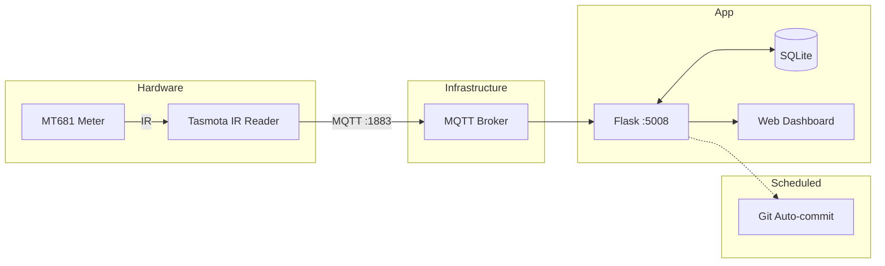

# Energy Monitor

Real-time energy monitoring dashboard for MT681 smart meters via Tasmota MQTT.

## Screenshot


## Tech Stack

Python 3.12, Flask 3.x, SQLAlchemy 2.x, paho-mqtt 2.x, SQLite, uPlot (frontend charting)

## Architecture



**Data flow:** Meter → IR → Tasmota → MQTT → Flask → SQLite → REST API → Browser

## Hardware

- MT681 smart meter (or compatible SML meter)
- [Stromleser WiFi Smart Meter IR Reading Head](https://www.amazon.de/-/en/dp/B0DJP2MDLK) (Tasmota-flashed)

## Prerequisites

- Python 3.12+
- uv (Python package manager)
- MQTT broker (e.g., Mosquitto) running on the network
- Tasmota device configured to publish to `tele/tasmota/#`

## Installation

1. Clone and install dependencies:
   ```bash
   git clone https://github.com/momonala/energyMeter.git
   cd energyMeter
   curl -LsSf https://astral.sh/uv/install.sh | sh
   uv sync
   ```

2. Initialize the database:
   ```bash
   python database.py
   ```

3. Configure `config.py`:
   ```python
   DATABASE_URL = "sqlite:///data/energy.db"  # default
   SERVER_URL = "192.168.x.x"                 # MQTT broker IP (MUST CHANGE)
   MQTT_PORT = 1883                           # default MQTT port
   FLASK_PORT = 5008                          # web server port
   TOPIC = "tele/tasmota/#"                   # MQTT topic pattern
   TASMOTA_UI_URL = "http://192.168.x.x/"     # Tasmota device IP (optional)
  ```

4. Configure `values.py`:
  ```python 
   TELEGRAM_API_TOKEN
   TELEGRAM_CHAT_ID
   ```

## Running

```bash
python app.py
```

Open `http://localhost:5008`

## Dashboard Features

### Layout
- **Chart** (70% width): Power (W) and cumulative energy (kWh) over time
- **Selection Stats** (15% width): Statistics for the selected time range
- **Period Summary** (15% width): Today, this week, this month, and total consumption

### Live Updates
- Data refreshes every 10 seconds via incremental polling
- Only new data points are fetched and appended to the chart
- Visual flash indicator when new data arrives
- Auto-expands view if watching near real-time (within 2 minutes of latest data)

### Keyboard Shortcuts

| Key | Action |
|-----|--------|
| `R` | Refresh data |
| `Esc` | Reset selection / zoom |
| `1` | View last hour |
| `2` | View last day |
| `3` | View last week |
| `4` | View last month |
| `5` | View last year |

### Touch Support
- Optimized for iPad landscape mode
- Drag to select time range
- Double-tap to reset zoom

### Loading States
- Skeleton placeholders on initial load
- Chart loading overlay
- Button loading animation during refresh

## Project Structure

```
energy_monitor/
├── app.py              # Flask entry point, API routes, thread startup
├── database.py         # SQLAlchemy models, queries, stats
├── mqtt.py             # MQTT client, message parsing, data ingestion
├── scheduler.py        # Periodic tasks (health check, git commit)
├── git_tool.py         # Auto-commit DB changes to git
├── helpers.py          # Time parsing utilities
├── values.py           # Configuration constants
├── static/
│   ├── index.html      # Dashboard HTML
│   ├── app.js          # Frontend: charting, interactions, live updates
│   └── styles.css      # Styles with CSS custom properties
├── data/
│   └── energy.db       # SQLite database
└── install/
    ├── install.sh                        # Raspberry Pi setup script
    └── projects_energy_monitor.service   # systemd service file
```

## API Endpoints

| Endpoint | Method | Description |
|----------|--------|-------------|
| `/` | GET | Serve web dashboard |
| `/api/readings` | GET | Fetch readings with optional time range |
| `/api/latest_reading` | GET | Get most recent reading |
| `/api/stats` | GET | Compute statistics for a time range |
| `/status` | GET | Service health, connection status, job info |

### `/api/readings`

Query params:
- `start` - ISO-8601 string or ms since epoch (optional)
- `end` - ISO-8601 string or ms since epoch (optional)
- `after` - Unix timestamp; returns only records after this time (for incremental updates)

Response:
```json
[
  {"t": 1701432000000, "p": 450.5, "e": 12345.67}
]
```
- `t`: timestamp (ms since epoch)
- `p`: power (watts)
- `e`: cumulative energy (kWh)

### `/api/stats`

Query params (required):
- `start` - ISO-8601 string or ms since epoch
- `end` - ISO-8601 string or ms since epoch

Response:
```json
{
  "start": 1701432000000,
  "end": 1701518400000,
  "stats": {
    "energy_used_kwh": 12.5,
    "min_power_watts": 120.0,
    "max_power_watts": 3500.0,
    "avg_power_watts": 450.2,
    "count": 8640
  }
}
```

## Data Model

```
EnergyReading
├── timestamp: DateTime (PK, indexed)
├── meter_id: String
├── power_watts: Float
├── energy_in_kwh: Float
├── energy_out_kwh: Float
├── power_phase_1_watts: Float
├── power_phase_2_watts: Float
├── power_phase_3_watts: Float
└── raw_payload: Text (JSON)
```

## Key Concepts

| Concept | Description |
|---------|-------------|
| `energy_in_kwh` | Cumulative energy consumed from grid (meter reading) |
| `energy_out_kwh` | Cumulative energy exported to grid (for solar) |
| `power_watts` | Instantaneous power draw |
| `MT681` | Smart meter model; payload key in Tasmota MQTT messages |
| `E_in` / `E_out` | Tasmota payload fields for energy in/out |

## Storage

| Path | Purpose |
|------|---------|
| `data/energy.db` | SQLite database with all readings |
| `data/energy.db.bk` | Backup copy (created hourly) |

## Background Jobs

Runs via `schedule` library in a background thread:

| Schedule | Task |
|----------|------|
| Hourly `:00` | Log DB health check (reading counts) |
| Hourly `:00` | Commit DB to git if changed (amend + force push) |

## Deployment (Raspberry Pi)

1. Run the install script:
   ```bash
   cd install
   ./install.sh
   ```

   This will:
   - Install uv (if not already installed)
   - Install dependencies via uv
   - Set up systemd service
   - Configure Cloudflare tunnel (if applicable)

2. Service management:
   ```bash
   sudo systemctl status projects_energy_monitor.service
   sudo systemctl restart projects_energy_monitor.service
   journalctl -u projects_energy_monitor.service -f
   ```

## Development Commands

```bash
# Format code
black . && isort .

# Sync to Raspberry Pi
rsync -av --exclude 'data/' . mnalavadi@192.168.2.107:/home/mnalavadi/energy_monitor

# Pull DB from Raspberry Pi
rsync -av mnalavadi@192.168.2.107:/home/mnalavadi/energy_monitor/data/ ./data/
```

## Known Limitations

- MQTT loop skipped on macOS (`sys.platform == "darwin"`) - designed for headless Linux deployment
- Git auto-commit uses `--amend --force` - single commit history for DB file
- No authentication on API endpoints
