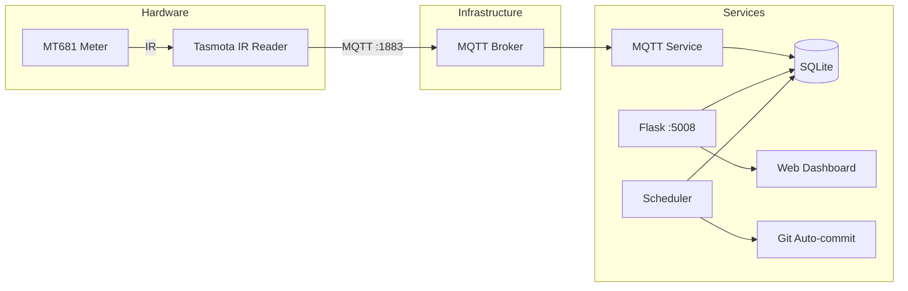

# Energy Monitor

[CI](https://github.com/momonala/energy-monitor/actions/workflows/ci.yml)
[codecov](https://codecov.io/gh/momonala/energy-monitor)

Real-time energy monitoring dashboard for MT681 smart meters via Tasmota MQTT.

## Screenshot

Dashboard

## Tech Stack

Python 3.12, Flask 3.x, SQLAlchemy 2.x, paho-mqtt 2.x, SQLite, uPlot (frontend charting)

## Architecture



**Data flow:** Meter → IR → Tasmota → MQTT Broker → MQTT Service → SQLite → Flask REST API → Browser

## Hardware

- MT681 smart meter (or compatible SML meter)
- [Stromleser WiFi Smart Meter IR Reading Head](https://www.amazon.de/-/en/dp/B0DJP2MDLK) (Tasmota-flashed)

## Prerequisites

- Python 3.12+
- uv (Python package manager)
- MQTT broker (e.g., Mosquitto) running on the network
- Tasmota device configured to publish to `tele/tasmota/#`

## Installation

1. Clone and install dependencies:
  ```bash
   git clone https://github.com/momonala/energyMeter.git
   cd energyMeter
   curl -LsSf https://astral.sh/uv/install.sh | sh
   uv sync
  ```
2. Initialize the database:
  ```bash
   uv run python -m src.database
  ```
3. Configure `pyproject.toml`:
  Edit the `[tool.config]` section with your settings:
4. Configure `src/values.py`:
  ```python
   TELEGRAM_API_TOKEN
   TELEGRAM_CHAT_ID
  ```

## Running

```bash
uv run app
```

Open `http://localhost:5008`

## Dashboard Features

### Layout

- **Chart** (70% width): Power (W), cumulative energy (kWh), and daily usage trend (30-day moving average or total average)
- **Selection Stats** (15% width): Statistics for the selected time range
- **Period Summary** (15% width): Today, this week, this month, and total consumption

### Live Updates

- Data refreshes every 10 seconds via incremental polling
- Only new data points are fetched and appended to the chart
- Visual flash indicator when new data arrives
- Auto-expands view if watching near real-time (within 2 minutes of latest data)

### Keyboard Shortcuts


| Key   | Action                 |
| ----- | ---------------------- |
| `R`   | Refresh data           |
| `Esc` | Reset selection / zoom |
| `1`   | View last hour         |
| `2`   | View last day          |
| `3`   | View last week         |
| `4`   | View last month        |
| `5`   | View last year         |


### Touch Support

- Optimized for iPad landscape mode
- Drag to select time range
- Double-tap to reset zoom

### Controls

**Trace Toggles (Row 1):**

- Show/hide individual series: Live Power | Daily Usage | 30d Avg | Avg Power | Meter Reading

**Actions & Time Filters (Row 2):**

- **Refresh**: Reload all data from server
- **Reset**: Clear selection and show full data range
- **📊 Auto / Fixed**: Toggle power axis between auto-scaling and fixed 0-2000W range
- **📈 30d / Total**: Toggle daily usage baseline between 30-day moving average (adaptive) and total average (flat line)
- **Hour / Day / Week / Month / Year**: Quick zoom to time range

### Loading States

- Skeleton placeholders on initial load
- Chart loading overlay
- Button loading animation during refresh

## Mobile Dashboard

A simplified, mobile-optimized interface is available at `/mobile`. Mobile users (iPhone, Android) are automatically redirected; iPad users see the full desktop dashboard.

### Mobile Features

- **Lookback Period**: Manual input field to select number of days (default: 7, max: 365)
- **Compact Chart**: Non-interactive chart showing power, energy, daily usage, and 30-day average
- **Series Toggles**: Tap to show/hide chart series (Power, Meter, Daily, 30d Avg)
- **Stats Cards**: Energy & cost (real vs typical), power statistics, data info
- **Daily Breakdown Table**: Per-day usage with typical comparison and difference highlighting
- **Desktop Link**: Easy navigation back to full dashboard

### Mobile Detection

Automatic redirect based on User-Agent:
- **Redirected to mobile**: iPhone, Android, iPod, BlackBerry, Windows Phone
- **Stay on desktop**: iPad, desktop browsers
- **Manual access**: `/mobile` is always accessible directly

## Project Structure

```
energy-monitor/
├── src/
│   ├── app.py          # Flask entry point, API routes, mobile detection
│   ├── database.py     # SQLAlchemy models, queries, stats
│   ├── mqtt.py         # Standalone MQTT client service entry point
│   ├── scheduler.py    # Standalone scheduler entry point (health check, git commit)
│   ├── git_tool.py     # Auto-commit DB changes to git
│   ├── helpers.py      # Time parsing utilities
│   ├── config.py       # Configuration constants
│   └── values.py       # Secret values (Telegram tokens)
├── static/
│   ├── index.html      # Desktop dashboard HTML
│   ├── mobile.html     # Mobile dashboard HTML
│   ├── app.js          # Desktop frontend: charting, interactions, live updates
│   ├── mobile.js       # Mobile frontend: simplified chart, stats, daily table
│   ├── shared.js       # Shared utilities (formatting, colors, data processing)
│   └── styles.css      # Styles with CSS custom properties (desktop + mobile)
├── data/
│   └── energy.db       # SQLite database
├── tests/
│   └── test_*.py       # Test files
└── install/
    ├── install.sh                              # Raspberry Pi setup script
    ├── projects_energy-monitor.service         # systemd service for web app
    ├── projects_energy-monitor_mqtt.service    # systemd service for MQTT client
    └── projects_energy-monitor_data-backup-scheduler.service # systemd service for scheduler
```

## API Endpoints


| Endpoint              | Method | Description                                              |
| --------------------- | ------ | -------------------------------------------------------- |
| `/`                   | GET    | Serve desktop dashboard (redirects mobile to `/mobile`)  |
| `/mobile`             | GET    | Serve mobile-optimized dashboard                         |
| `/api/readings`       | GET    | Fetch readings with optional time range                  |
| `/api/latest_reading` | GET    | Get most recent reading                                  |
| `/api/energy_summary` | GET    | Get avg daily usage, daily usage, and 30d moving average |
| `/api/stats`          | GET    | Compute statistics for a time range                      |
| `/status`             | GET    | Service health, connection status, job info              |


### `/api/readings`

Query params:

- `start` - ISO-8601 string or ms since epoch (optional)
- `end` - ISO-8601 string or ms since epoch (optional)
- `after` - Unix timestamp; returns only records after this time (for incremental updates)

Response:

```json
[
  {"t": 1701432000000, "p": 450.5, "e": 12345.67}
]
```

- `t`: timestamp (ms since epoch)
- `p`: power (watts)
- `e`: cumulative energy (kWh)

### `/api/energy_summary`

No parameters required.

Response:

```json
{
  "avg_daily": 15.2,
  "daily": [
    {"t": 1701432000000, "kwh": 14.5, "is_partial": false},
    {"t": 1701518400000, "kwh": 15.8, "is_partial": false}
  ],
  "moving_avg_30d": [
    {"t": 1701432000000, "kwh": 14.2},
    {"t": 1701518400000, "kwh": 14.8}
  ]
}
```

- `avg_daily`: Average daily kWh over the last year
- `daily`: Daily kWh consumption for each day
- `moving_avg_30d`: 30-day moving average of daily consumption (or fewer days for dates with less history)

### `/api/stats`

Query params (required):

- `start` - ISO-8601 string or ms since epoch
- `end` - ISO-8601 string or ms since epoch

Response:

```json
{
  "start": 1701432000000,
  "end": 1701518400000,
  "stats": {
    "energy_used_kwh": 12.5,
    "min_power_watts": 120.0,
    "max_power_watts": 3500.0,
    "avg_power_watts": 450.2,
    "count": 8640
  }
}
```

## Data Model

```
EnergyReading
├── timestamp: DateTime (PK, indexed)
├── meter_id: String
├── power_watts: Float
├── energy_in_kwh: Float
├── energy_out_kwh: Float
├── power_phase_1_watts: Float
├── power_phase_2_watts: Float
├── power_phase_3_watts: Float
└── raw_payload: Text (JSON)
```

## Key Concepts


| Concept          | Description                                             |
| ---------------- | ------------------------------------------------------- |
| `energy_in_kwh`  | Cumulative energy consumed from grid (meter reading)    |
| `energy_out_kwh` | Cumulative energy exported to grid (for solar)          |
| `power_watts`    | Instantaneous power draw                                |
| `MT681`          | Smart meter model; payload key in Tasmota MQTT messages |
| `E_in` / `E_out` | Tasmota payload fields for energy in/out                |


## Storage


| Path                | Purpose                           |
| ------------------- | --------------------------------- |
| `data/energy.db`    | SQLite database with all readings |
| `data/energy.db.bk` | Backup copy (created hourly)      |


## Background Jobs

The scheduler service runs periodic tasks via the `schedule` library:


| Schedule     | Task                                             |
| ------------ | ------------------------------------------------ |
| Hourly `:00` | Log DB health check (reading counts)             |
| Hourly `:00` | Commit DB to git if changed (amend + force push) |


Run services separately:

```bash
# Run MQTT client
uv run python -m src.mqtt

# Run scheduler
uv run python -m src.scheduler
```

## Deployment (Raspberry Pi)

1. Run the install script:
  ```bash
   cd install
   ./install.sh
  ```
   This will:
  - Install uv (if not already installed)
  - Install dependencies via uv
  - Set up systemd services (web app, MQTT client, and scheduler)
  - Configure Cloudflare tunnel (if applicable)
2. Service management:
  Three services are installed:

  | Service                                                 | Purpose                                       | Port |
  | ------------------------------------------------------- | --------------------------------------------- | ---- |
  | `projects_energy-monitor.service`                       | Flask web application                         | 5008 |
  | `projects_energy-monitor_mqtt.service`                  | MQTT client for receiving meter data          | N/A  |
  | `projects_energy-monitor_data-backup-scheduler.service` | Hourly database health checks and git backups | N/A  |

  ```bash
  # Check status
  sudo systemctl status projects_energy-monitor.service
  sudo systemctl status projects_energy-monitor_mqtt.service
  sudo systemctl status projects_energy-monitor_data-backup-scheduler.service

  # View logs
  sudo journalctl -u projects_energy-monitor.service -f
  sudo journalctl -u projects_energy-monitor_mqtt.service -f
  sudo journalctl -u projects_energy-monitor_data-backup-scheduler.service -f

  # Restart services
  sudo systemctl restart projects_energy-monitor.service
  sudo systemctl restart projects_energy-monitor_mqtt.service
  sudo systemctl restart projects_energy-monitor_data-backup-scheduler.service
  ```


## Development Commands

```bash
# Format code
black . && isort .

# Sync to Raspberry Pi
rsync -av --exclude 'data/' . mnalavadi@192.168.2.107:/home/mnalavadi/energy-monitor

# Pull DB from Raspberry Pi
rsync -av mnalavadi@192.168.2.107:/home/mnalavadi/energy-monitor/data/ ./data/
```

## Known Limitations

- MQTT loop skipped on macOS (`sys.platform == "darwin"`) - designed for headless Linux deployment
- Git auto-commit uses `--amend --force` - single commit history for DB file
- No authentication on API endpoints

